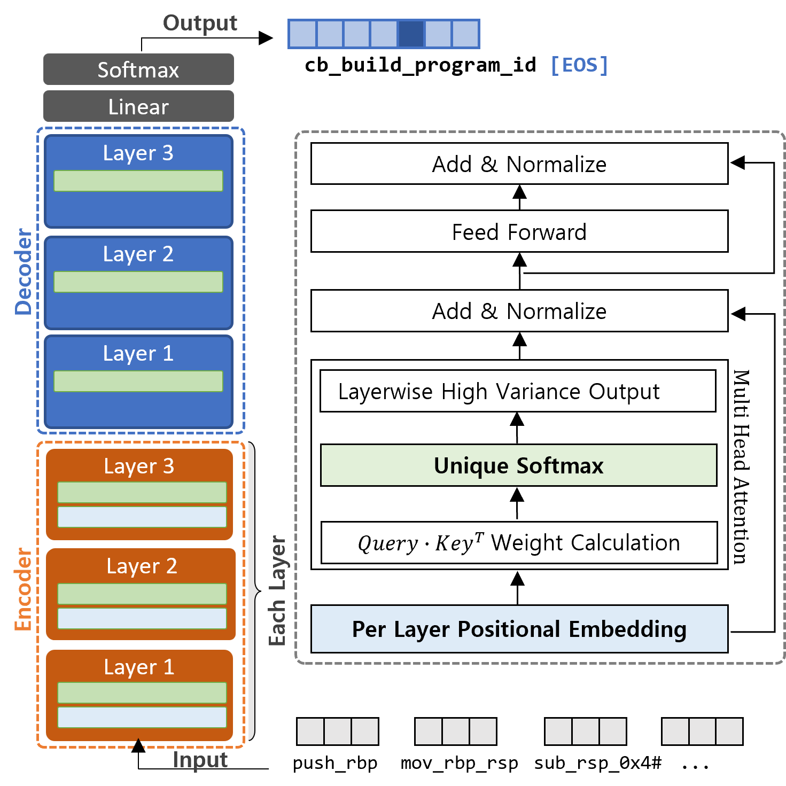

# A Transformer-based Function Symbol Name Inference Model from an Assembly Language for Binary Reversing
----
This is the official implementation of **AsmDepictor**, "A Transformer-based Function Symbol Name Inference Model from an Assembly Language for Binary Reversing", In the 18th ACM Asia Conference on Computer and Communications Security [AsiaCCS '2023](https://asiaccs2023.org/)

<p align = "center">

</p>
<p align = "center">
Figure 1. AsmDepictor architecture that consists of a stacked Transformer-based encoder and decoder. We adopt a perlayer positional embedding (at encoders) for learning the positional representation of an assembly, and a Unique-softmax function (at both encoders and decoders) for better quality of vectors per each layer, leading a high performance on a function symbol inference task.
</p>

----
# Installation

This project has been experimented on the following specification.

```
Intel(R) Xeon(R) Gold 5218R CPU @ 2.10GHz
NVIDIA RTX A6000 (48 GB VRAM)
Ubuntu 20.04.4 LTS
Python 3.9.12
Anaconda 4.10.1
```
1. Install all dependent libraries with the Conda environment.
```
pip install -r requirement.txt
```

2. Choose the right one from https://pytorch.org/get-started/locally/ for the Pytorch library. 
```
conda install pytorch torchvision torchaudio cudatoolkit=11.3 -c pytorch
```

3. The following loads a pretrained AsmDepictor model with a prediction on a test set.
```
python ./load_model_extract.py
```

4. You may want to learn a model from the scratch and evaluate a dataset.
A tensorboard will demonstrate learning details with ```tensorboard --logdir=./runs```.
Note that you need at least 64GB of VRAM for training.
```
python ./learn_model_from_scratch.py
```

5. Our dataset and pre-trained model can be downloaded 
at https://drive.google.com/file/d/1-oMQnmRj7KrsLBRD1QE1xVQqcn8C4Dhv/view?usp=sharing.
----
# Performance

- TBD

----
# To-do
1. Add performance graph
2. Add binary preprocessing (IDA Scripts)
3. Change dataset and model download link