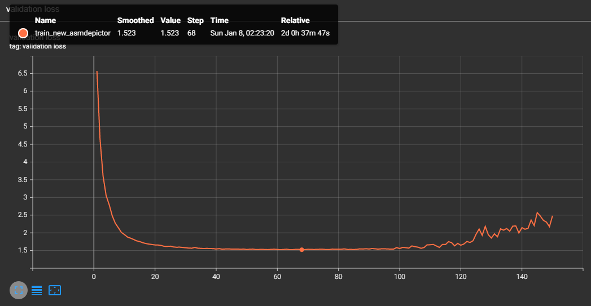

# A Transformer-based Function Symbol Name Inference Model from an Assembly Language for Binary Reversing

This is the official implementation of **AsmDepictor**, "A Transformer-based Function Symbol Name Inference Model from an Assembly Language for Binary Reversing", In the 18th ACM Asia Conference on Computer and Communications Security [AsiaCCS '2023](https://asiaccs2023.org/)

<p align = "center">

</p>
<p align = "center">
Figure 1. AsmDepictor architecture that consists of a stacked Transformer-based encoder and decoder. We adopt a perlayer positional embedding (at encoders) for learning the positional representation of an assembly, and a Unique-softmax function (at both encoders and decoders) for better quality of vectors per each layer, leading a high performance on a function symbol inference task.
</p>

# Installation

This project has been experimented on the following specification.

```
Intel(R) Xeon(R) Gold 5218R CPU @ 2.10GHz
NVIDIA RTX A6000 (48 GB VRAM)
Ubuntu 20.04.4 LTS
Python 3.9.12
Anaconda 4.10.1
```
1. Install all dependent libraries with the Conda environment.
```
pip install -r requirement.txt
```

2. Choose the right one from https://pytorch.org/get-started/locally/ for the Pytorch library. 
```
conda install pytorch torchvision torchaudio cudatoolkit=11.3 -c pytorch
```

3. The following loads a pretrained AsmDepictor model with a prediction on a test set.
```
python ./load_model_extract.py
```

4. You may want to learn a model from the scratch and evaluate a dataset.
A tensorboard will demonstrate learning details with ```tensorboard --logdir=./runs```.
Note that you need at least 64GB of VRAM for training.
```
python ./learn_model_from_scratch.py
```

5. Our dataset and pre-trained model can be downloaded 
at https://zenodo.org/record/7978756


# Hyperparameter

| **Hyperparameter**             | AsmDepictor with $\mathbf{DS_{N}}$   | AsmDepictor with $\mathbf{DS_{A}}$   |
|--------------------------------|---------------------|---------------------|
| Max token length               | 300                 | 300                 |
| Number of encoder layers       | 3                   | 3                   |
| Number of decoder layers       | 3                   | 3                   |
| Head dimension                 | 64                  | 64                  |
| Embedding dimension            | 512                 | 512                 |
| **Batch size**                 | **10**              | **90**              |
| Attention heads                | 8                   | 8                   |
| Feed forward dimension         | 2,048               | 2,048               |
| Dropout ratio                  | 0.1                 | 0.1                 |
| Training epochs                | 150                 | 200                 |
| Adam $\beta_1$                 | 0.9                 | 0.9                 |
| Adam $\beta_2$                 | 0.98                | 0.98                |
| Adam $\epsilon$                | $10^{-9}$           | $10^{-9}$           |
| Beam size                      | 5                   | 5                   |
| **Multiplication factor**      | **0.8**             | **1.0**             |
| **Warmup steps**               | **24,000**          | **18,000**          |
| **Number of parameters**       | **32,251,910**      | **40,004,102**      |

# Hyperparameter setting guide for your own dataset
I strongly recommend reading https://github.com/jadore801120/attention-is-all-you-need-pytorch/pull/168
to fit with your own data

# Performance
- We gained a meaningful amount of performance gain after publishing our paper. We denote our updated performance evaluation for future research.

<p align = "center">

</p>
<p align = "center">
Figure 2. Performance graph of AsmDepictor (F1-score: 80.85%)
</p>

<p align = "center">

</p>
<p align = "center">
Figure 3. Performance graph of AsmDepictor (Jaccard accuracy: 81.63%)
</p>

<p align = "center">

</p>
<p align = "center">
Figure 4. Performance graph of AsmDepictor (Lowest Loss: 1.523)
</p>

----
# To-do
1. Add binary preprocessing (IDA Scripts)